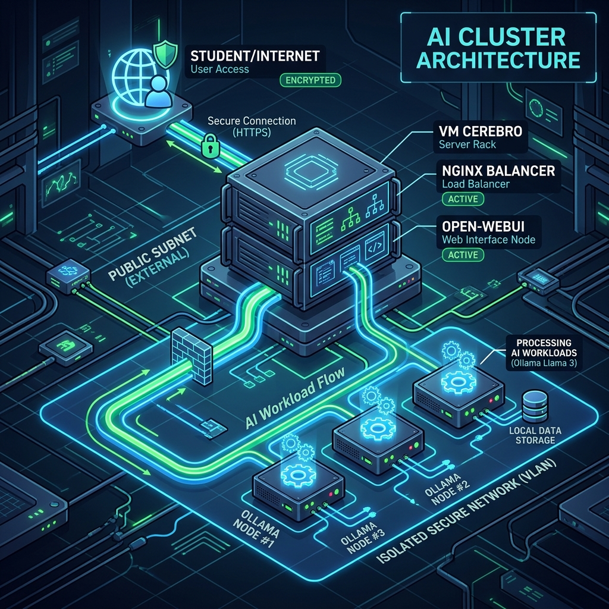
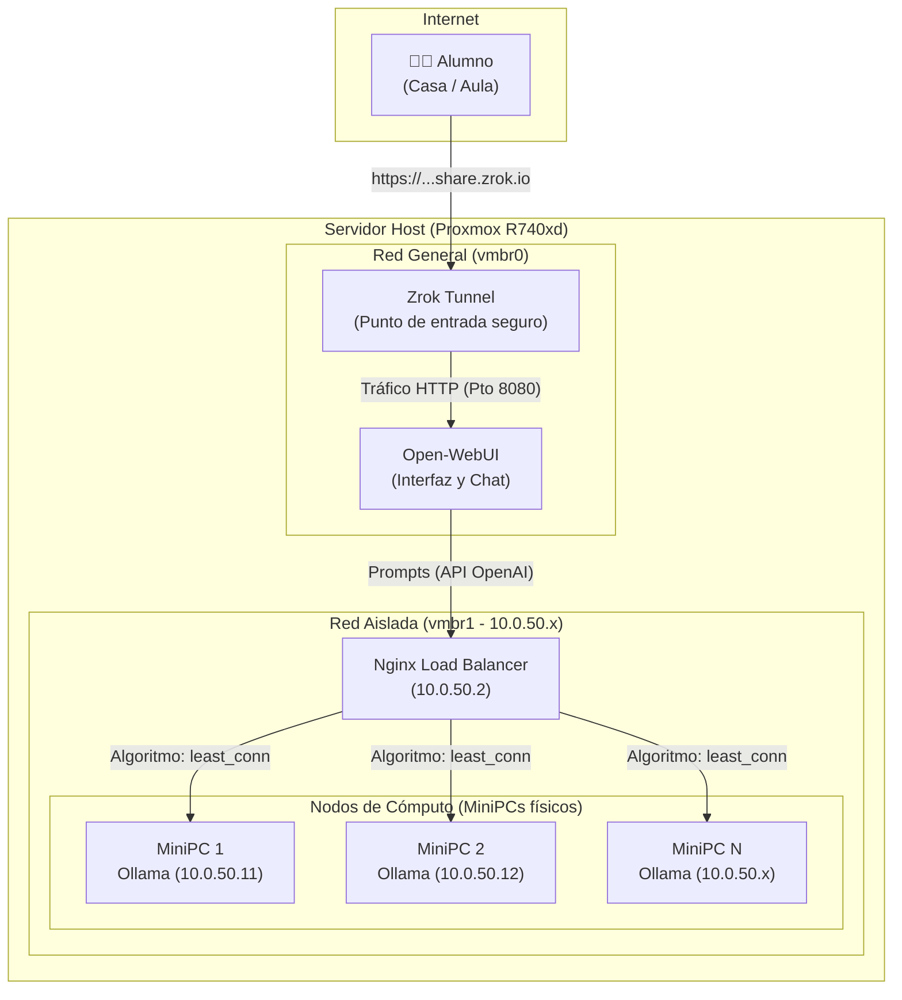
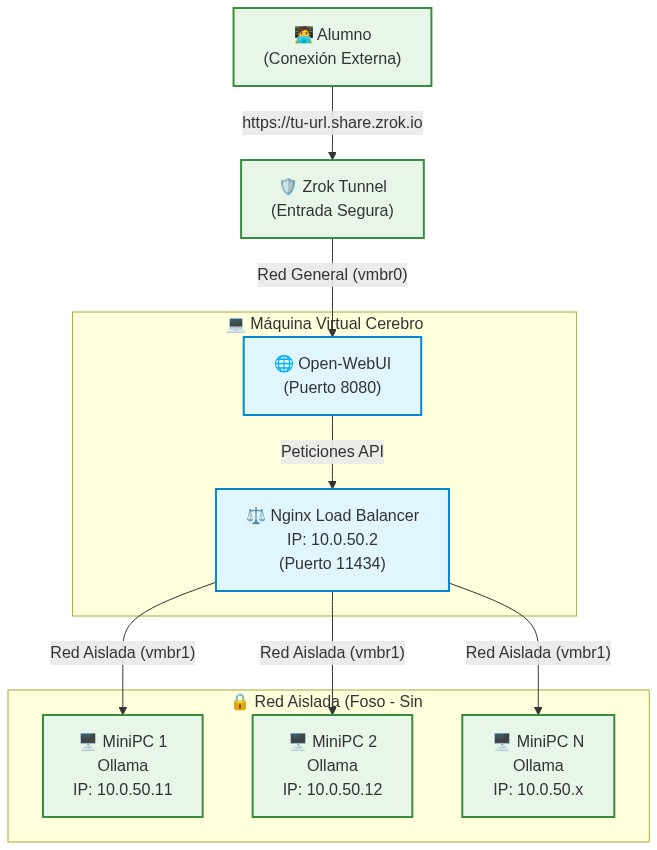

# 🧠 GiomAI - Infraestructura de Inteligencia Artificial Distribuida

<div align="center">
  
</div>

Bienvenido a la documentación oficial de **GiomAI**, un proyecto diseñado para desplegar un clúster de Inteligencia Artificial local, escalable y seguro para entornos educativos (institutos).

---

## 📖 Índice

1. [Visión General del Proyecto](#1-visión-general-del-proyecto)
2. [Características del Hardware](#2-características-del-hardware)
3. [Topología de Red y Arquitectura](#3-topología-de-red-y-arquitectura)
4. [Guía de Despliegue Rápido](#4-guía-de-despliegue-rápido)
    - [Fase 1: Servidor Host (Proxmox)](#fase-1-servidor-host-proxmox)
    - [Fase 2: Máquina Virtual "Cerebro"](#fase-2-máquina-virtual-cerebro)
    - [Fase 3: Nodos de Cómputo (MiniPCs)](#fase-3-nodos-de-cómputo-minipcs)
5. [Mantenimiento y Escalabilidad](#5-mantenimiento-y-escalabilidad)

---

## 1. Visión General del Proyecto

**GiomAI** busca aprovechar un servidor central potente y varios MiniPCs de bajo coste para crear un clúster de inferencia de IA. 
El sistema permite que los alumnos accedan desde cualquier lugar mediante un túnel seguro (Zrok) a una interfaz amigable (Open-WebUI). Las peticiones se balancean dinámicamente hacia el MiniPC con menor carga en una red interna totalmente aislada.

**Puntos Clave:**
- **Seguridad:** Los nodos de inferencia están en una red aislada sin salida a internet (Foso).
- **Escalabilidad:** Se pueden añadir o quitar MiniPCs en caliente sin interrumpir el servicio.
- **Privacidad:** Toda la inferencia y almacenamiento del historial se realiza de forma local en el instituto.

---

## 2. Características del Hardware

### El Host Principal: Dell PowerEdge R740xd

El núcleo de la infraestructura virtual se ejecuta en este servidor empresarial diseñado para funcionar ininterrumpidamente.

| Componente | Detalle Técnico | Impacto en el Laboratorio (ASIR / IA) |
| :--- | :--- | :--- |
| **Modelo** | Dell PowerEdge R740xd | Chasis de 2U en rack. Optimizado para alta densidad de almacenamiento. |
| **CPU** | 2x Intel Xeon Gold 6138 | 40 núcleos físicos / 80 hilos. Excelente para virtualizar toda la red. |
| **RAM** | 128 GB DDR4 (NUMA) | Capacidad masiva para máquinas virtuales y caché de base de datos. |
| **Red (NIC)** | Mínimo 2 interfaces (1GbE/10GbE) | Permite separar físicamente la red pública de la red aislada de IA. |

*Nota sobre Expansión:* Cuenta con múltiples ranuras PCIe Gen3 libres para instalar gráficas NVIDIA en el futuro, doble fuente redundante para picos de consumo y iDRAC9 para gestión remota.

### Los Nodos de Cómputo: MiniPCs

Son los "obreros" del sistema. Equipos pequeños y de bajo consumo que ejecutan el motor **Ollama** y procesan las peticiones enviadas por el balanceador. Si se necesita más potencia simultánea, simplemente se conectan más MiniPCs al switch de la red aislada.

---

## 3. Topología de Red y Arquitectura

La arquitectura se divide en dos redes principales para garantizar un control total del tráfico:
- **Red General (vmbr0):** Con salida a internet. Por aquí entra la conexión segura de los alumnos vía Zrok y sale el tráfico de Open-WebUI.
- **Red Aislada (vmbr1 / VLAN 10.0.50.x):** Sin salida a internet (excepto cuando se abren los puertos por mantenimiento). Aquí viven los MiniPCs para evitar filtraciones y accesos no autorizados.



*(También tienes disponible la vista técnica con IPs precisas generada como imagen estática)*
<div align="center">
  
</div>

---

## 4. Guía de Despliegue Rápido

Todo el proyecto está automatizado mediante scripts públicos (`setup_*.sh`). Para levantar la infraestructura desde cero, sigue estos tres pasos en orden.

### Fase 1: Servidor Host (Proxmox)
Esta configuración prepara el script de enrutamiento para poder dar internet de forma puntual a los MiniPCs.

Entra a la terminal de Proxmox como root y ejecuta:
```bash
curl -sSL https://raw.githubusercontent.com/iesamachado/giomAI/main/setup_proxmox.sh | bash
```

### Fase 2: Máquina Virtual "Cerebro"
Esta VM (con dos tarjetas de red, conectada a `vmbr0` y `vmbr1`) alojará la web, el túnel y el balanceador de carga.

Dentro de la VM, ejecuta:
```bash
curl -sSL https://raw.githubusercontent.com/iesamachado/giomAI/main/setup_vm.sh | bash
```

**⚠️ Paso Manual Post-Instalación:** 
Edita el archivo `/opt/ai-cluster/docker-compose.yml` para introducir tu token real de Zrok. Luego, lanza el servicio:
```bash
cd /opt/ai-cluster/
docker compose up -d
```

### Fase 3: Nodos de Cómputo (MiniPCs)
Los MiniPCs viven en el foso. Para configurarlos, hay que darles salida a internet momentáneamente.

1. En Proxmox, abre el foso: 
   ```bash
   /root/scripts_red/abrir_internet.sh
   ```
2. En cada MiniPC, lanza el autoinstalador (instalará Ollama y descargará Llama 3.2):
   ```bash
   curl -sSL https://raw.githubusercontent.com/iesamachado/giomAI/main/scripts_minipc/setup_minipc.sh | bash
   ```
3. En Proxmox, vuelve a cerrar el foso por seguridad:
   ```bash
   /root/scripts_red/cerrar_internet.sh
   ```

---

## 5. Mantenimiento y Escalabilidad

El clúster está diseñado para la Alta Disponibilidad (High Availability). Puedes añadir o quitar potencia sin cortar el servicio.

Si vas a añadir un nuevo nodo, prepáralo primero siguiendo la **Fase 3** (abrir foso > ejecutar script de minipc > cerrar foso).

Una vez que el nodo está operativo (o si necesitas dar de baja temporalmente uno para repararlo), usa el gestor integrado en la Máquina Virtual Cerebro:

**Añadir un nodo al balanceador:**
```bash
cd /opt/ai-cluster/
./manage_nodes.sh add <IP_DEL_NODO>
# Ejemplo: ./manage_nodes.sh add 10.0.50.13
```

**Quitar un nodo del balanceador:**
```bash
cd /opt/ai-cluster/
./manage_nodes.sh remove <IP_DEL_NODO>
# Ejemplo: ./manage_nodes.sh remove 10.0.50.11
```

El script modifica la tabla de ruteo de Nginx y recarga la configuración en caliente de forma totalmente transparente para los alumnos que estén usando el chat en ese momento.
